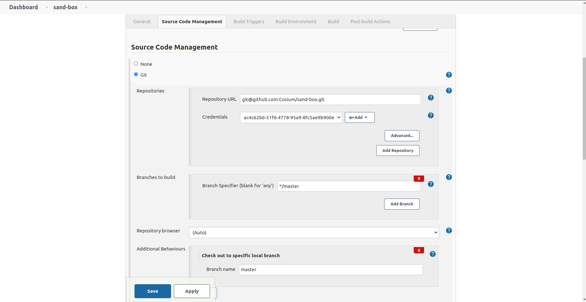
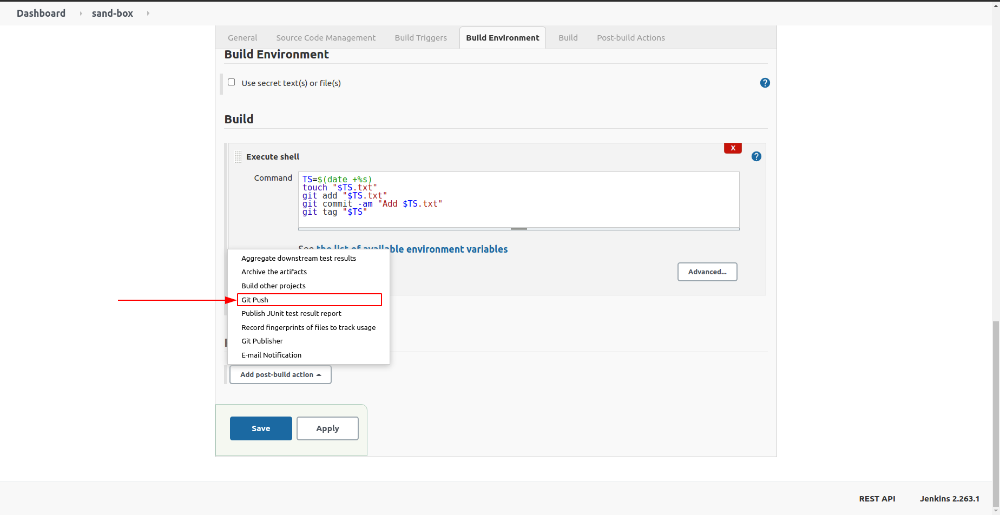
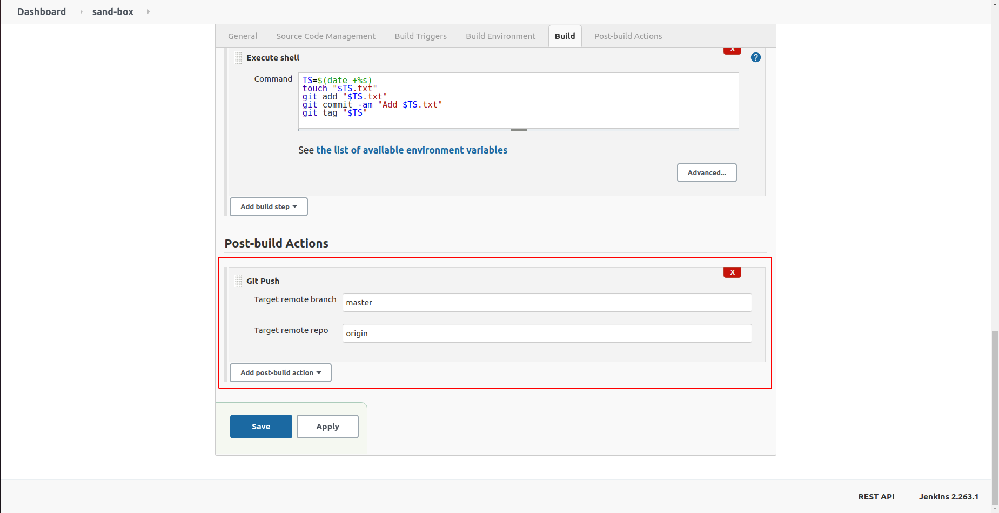

# git-push

## Introduction

This plugin allows to perform a git push as a post build step via [Git Plugin](https://plugins.jenkins.io/git)

In details, the plugin will pull then push (tags included) to the selected remote branch.

## Getting started

The instructions below are based on a Jenkins job created as a Freestyle project.

Open the Jenkins job configuration.

Make sure the job uses git `Source Code Management`.
For example, a basic git configuration could look like this:

Add `Git Push` as a post build action:

Configure the action:

## Issues

Report issues and enhancements in the [Issue tracker](https://github.com/jenkinsci/git-push-plugin/issues).

## Contributing

Refer to our [contribution guidelines](https://github.com/jenkinsci/.github/blob/master/CONTRIBUTING.md)

## LICENSE

Licensed under MIT, see [LICENSE](LICENSE.md)

